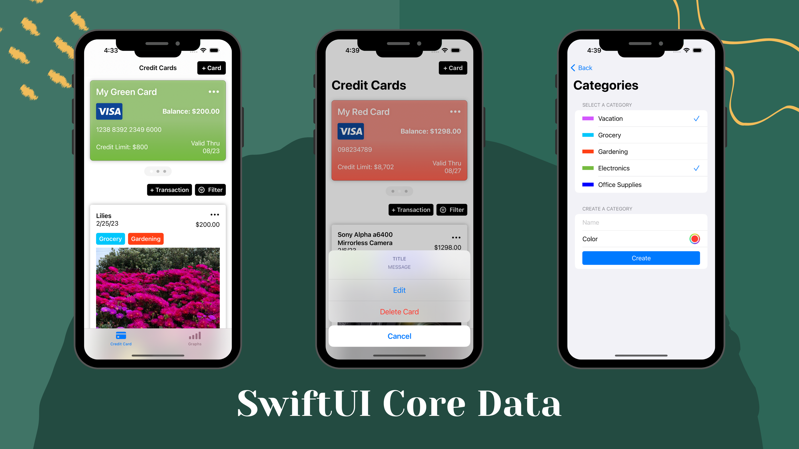

## About Me ✍️
Hey there, I'm Tina, a passionate self-taught iOS developer who's in love with creating products to enhance daily lives of yours and mine.

## Portfolio ☕
#### List out of transactions under various created credit cards with categories as your own preference, including beautiful crystal reports on iPad as your unique asset.

  
  

 

- UI Display with Credit Cards
  - Card Form Pickers
- Persisting Card Information with Core Data  
- Adding Card Transactions
  - Involving Photo Picker with UIViewControllerRepresentable
  - One to Many Relationship Transactions 
- Many to Many Transactions
  - Category Selection Bindings 
  - Seed DB and Prefill Form
  - Filtering Algorithm 
  - Card Balance Reduced Function
- iPad Support and Device Classes

## Language & Tools I Experienced In☕

      

